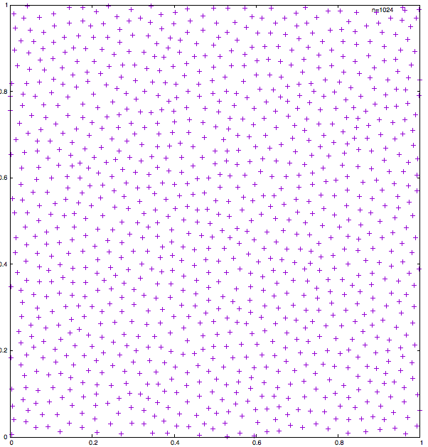
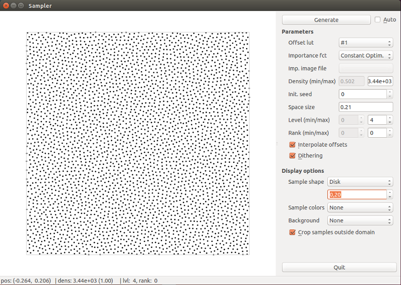
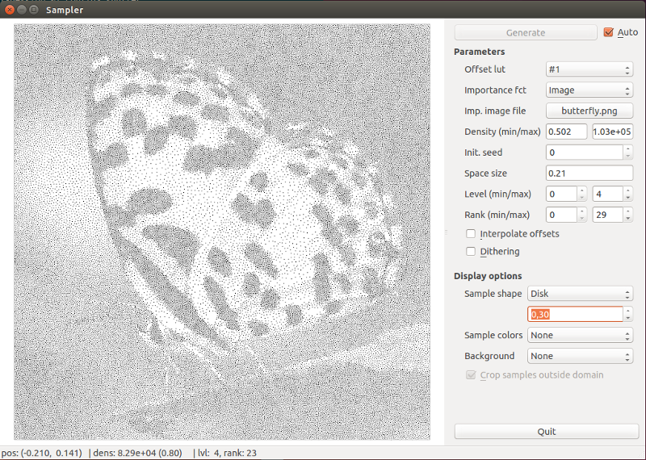

Polyhex Sampler
===============

Description
-----------
A fast and high quality sampling system.

* uniform sampling at more than 1 millions points / second
* adaptive sampling from image or function

This is an implementation of the article "Fast Tile-Based Adaptive Sampling with User-Specified Fourier Spectra" published in ACM SIGGRAPH 2014
See http://liris.cnrs.fr/polyhex

This repository provide:

* source code with tools to generate uniform and adaptive sampling.
* sampler-cli: a command line tool to generate uniform sampling.
* sampler-gui: a Qt interface to explore the capacities of the sampling system (uniform and adaptive sampling).

Build
-----

To build the sampler, several packages are requires:

* cmake (http://cmake.org) to generate the build project.
* Qt4 (Gui) (http://qt.digia.com)
* Boost (and boost-progam-options) for command-line parsing (http://boost.org)
* OpenGL with GLSL (version 330 minimum)
* SDL and SDL_image library

A classical commandline build process looks like

    mkdir build  ##Generate build folder
    cd build
    cmake ..     ##Check dependencies and generate a makefile
    make         ##Build

For best performances, you can compile with optimized flags: `cmake .. -DCMAKE_BUILD_TYPE=Release`

Once built, several executables are available in `build/bin`:

* `sampler-cli: command line uniform sampling tool
* `sampler-gui: Qt base sampler (uniform, adaptive, ...)

Data
----

This program needs full offsets table to produce best sampling distribution.
These tables are heavy (1.5G) and can be downloaded here: http://liris.cnrs.fr/polyhex/data/

Aternatively, `make GetLUT` (GetLUT target in your IDE) will download the data file to the folder `{your-build-folder}/data/lut`.

Usage examples
--------------

**sampler-cli**

Usage examples:

`./bin/sampler-cli -r data/lut/production_rules.dat -b data/lut/barycenters.dat -d data/lut/offsets_bnot.dat -n 1024 -o sampling.txt`

This procudes a uniform sampling with BNOT target spectra as a text file `sampling.txt` with x and y coordinates of the 1024 sample points. When plotting these points (e.g. with gnuplot), we obtain: 

**sampler-gui**

`./bin/sampler-gui -r data/lut/production_rules.dat -b data/lut/barycenters.dat -d data/lut/offsets_bnot.dat`

> *TIPS:*

> * You can use mouse scroll on almost all buttons to change their values more easily.

> * Activate `Auto` mode to generate new sampling each time a parameter changes.

LICENSE
-------

The MIT License (MIT)

Copyright (c) 2014 Polyhex sampling

Permission is hereby granted, free of charge, to any person obtaining a copy
of this software and associated documentation files (the "Software"), to deal
in the Software without restriction, including without limitation the rights
to use, copy, modify, merge, publish, distribute, sublicense, and/or sell
copies of the Software, and to permit persons to whom the Software is
furnished to do so, subject to the following conditions:

The above copyright notice and this permission notice shall be included in all
copies or substantial portions of the Software.

THE SOFTWARE IS PROVIDED "AS IS", WITHOUT WARRANTY OF ANY KIND, EXPRESS OR
IMPLIED, INCLUDING BUT NOT LIMITED TO THE WARRANTIES OF MERCHANTABILITY,
FITNESS FOR A PARTICULAR PURPOSE AND NONINFRINGEMENT. IN NO EVENT SHALL THE
AUTHORS OR COPYRIGHT HOLDERS BE LIABLE FOR ANY CLAIM, DAMAGES OR OTHER
LIABILITY, WHETHER IN AN ACTION OF CONTRACT, TORT OR OTHERWISE, ARISING FROM,
OUT OF OR IN CONNECTION WITH THE SOFTWARE OR THE USE OR OTHER DEALINGS IN THE
SOFTWARE.
